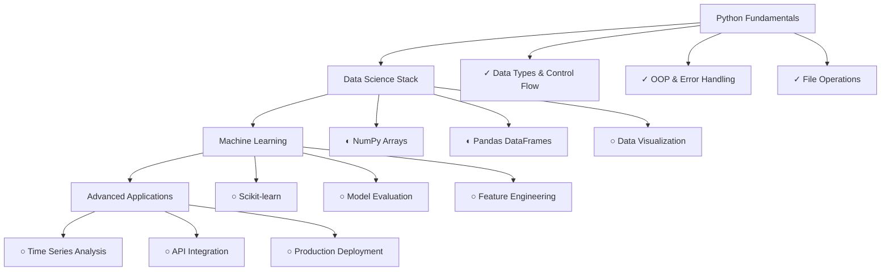

<div align="center">

# Python Mastery


</div>

---

## Philosophy

> Systematic approach to Python mastery through deliberate practice and real-world application

This repository documents my journey from Python fundamentals to advanced data science applications. Each section builds systematically on the previous, with practical projects that solve real problems.

**Linear algebra: complete.** Now applying that mathematical foundation to write efficient, elegant Python code.

---

<div align="center">

## Current Status

</div>

```python
class LearningJourney:
    def __init__(self):
        self.phase = "Data Science Foundation"
        self.primary_focus = "NumPy array operations and Pandas data manipulation"
        self.current_project = "Financial data analysis pipeline"
        self.next_milestone = "First Kaggle competition submission"
        self.philosophy = "Build to understand, not memorize to pass"
        
    def get_progress(self):
        return {
            "fundamentals": "Complete",
            "data_science": "In Progress - 60%",
            "ml_algorithms": "Planned",
            "production_ready": "Future Goal"
        }

journey = LearningJourney()
```

---

## Repository Architecture

<div align="center">

| **Directory** | **Purpose** | **Status** |
|:---|:---|:---:|
| `fundamentals/` | Core Python concepts with practical examples |  |
| `data-science/` | NumPy, Pandas, and scientific computing |  |
| `projects/` | Standalone applications showcasing concepts |  |
| `kaggle/` | Competition work and analysis |  |
| `daily-practice/` | Regular coding exercises and challenges |  |
| `resources/` | Learning notes and reference materials |  |

</div>

---

<div align="center">

## Learning Roadmap

</div>



---

## Featured Projects

<div align="center">

### Financial Data Analyzer
*Real-time stock data analysis using Python and Pandas*


**Focus**: Data pipelines, statistical analysis, mathematical modeling

---

### Expense Tracker Application
*Personal finance management with analytical capabilities*


**Focus**: Database integration, user interfaces, data persistence

</div>

---

<div align="center">

## Learning Methodology

</div>

<table align="center">
<tr>
<td align="center"><strong>Theory</strong></td>
<td align="center"><strong>Practice</strong></td>
<td align="center"><strong>Application</strong></td>
</tr>
<tr>
<td align="center">Understand the fundamentals<br><em>Why does this work?</em></td>
<td align="center">Build practical examples<br><em>How do I implement this?</em></td>
<td align="center">Apply to real problems<br><em>When would I use this?</em></td>
</tr>
</table>

**Core Principles:**
- No tutorial hell, no copy-paste coding
- Every line written with understanding
- Mathematical foundations applied practically
- Consistent daily practice with measurable progress

---

<div align="center">

## Tech Stack & Tools

**Development Environment**


**Current Focus**


**Next Phase**


</div>

---

<div align="center">

## Resources & References

**Primary Learning Materials**
- Python Crash Course (Eric Matthes)
- Effective Python (Brett Slatkin)  
- Python for Data Analysis (Wes McKinney)
- Kaggle Learn Courses

**Practice Platforms**
- LeetCode for algorithmic thinking
- Kaggle for data science applications
- Personal projects for real-world experience

</div>

---

<div align="center">

### Philosophy

*"The best way to learn programming is to program."*

**Current Focus**: Building expertise through systematic practice and real-world application of mathematical concepts in Python.


</div>
